<div align="center">


<br/>

[](https://www.python.org/)
[](https://streamlit.io/)
[](https://pandas.pydata.org/)
[](https://scipy.org/)
[](https://matplotlib.org/)
[](LICENSE)

<br/>

> **A comprehensive end-to-end analysis of student academic performance** using the UCI Student Performance dataset.  
> Covers preprocessing → correlation → lifestyle → statistical hypothesis testing → interactive Streamlit dashboard.

<br/>

[📊 View Dashboard](#-streamlit-dashboard) · [📁 Explore Modules](#-module-breakdown) · [💡 Showcase Insights](#-showcase-questions) · [🚀 Quick Start](#-quick-start)

</div>

---

## 📌 Project Overview

This project investigates what factors most significantly influence student academic performance — specifically final grades (G3) in Mathematics — using real-world data from Portuguese secondary schools.

The analysis spans **7 Python modules**, each targeting a specific dimension of student life:

| Dimension | Question Asked |
|---|---|
| 📖 Study Time | Does studying more hours per week lead to better grades? |
| 👨‍👩‍🎓 Parental Education | Do students with more educated parents perform better? |
| ⚥ Gender | Is there a statistically significant grade gap between genders? |
| 🔗 Correlation | Which variables are the strongest predictors of G3? |
| 🍺 Lifestyle | How do alcohol consumption and social habits affect performance? |
| 🧪 Statistics | Can ANOVA and t-tests validate these observations? |
| 💡 Policy | What interventions can schools implement based on this data? |

---

## 🗂 Dataset Description

| Property | Detail |
|---|---|
| **Source** | [UCI Machine Learning Repository](https://archive.ics.uci.edu/ml/datasets/Student+Performance) |
| **Original Files** | `student-mat.csv` (Math) · `student-por.csv` (Portuguese) |
| **Working File** | `student-mat-clean.csv` (cleaned & preprocessed) |
| **Records** | 395 students |
| **Features** | 33 attributes (demographic, social, academic) |
| **Target Variable** | `G3` — Final period grade (0–20 scale) |

**Key Variables Used:**

```
studytime   — Weekly study time (1=<2h, 2=2-5h, 3=5-10h, 4=>10h)
failures    — Number of past class failures (0–4)
absences    — Number of school absences
Medu/Fedu   — Mother's / Father's education level (0–4)
Dalc/Walc   — Workday / Weekend alcohol consumption (1–5)
goout       — Going out with friends (1–5)
sex         — Student gender (M/F)
G1, G2, G3  — Period grades 1, 2, 3 (0–20)
```

---

## 🛠 Tech Stack & Tools

<div align="center">

| Layer | Tool | Purpose |
|---|---|---|
| 🐍 Language | Python 3.11 | Core analysis language |
| 📊 Visualisation | Matplotlib 3.8 | Chart generation & PDF export |
| 🧮 Data | Pandas 2.1 · NumPy 1.26 | Data loading, cleaning, aggregation |
| 📐 Statistics | SciPy 1.11 | ANOVA, t-tests, Pearson correlation |
| 🌐 Dashboard | Streamlit 1.29 | Interactive web interface |
| 🖼 Image | Pillow 10.1 | PNG loading in Streamlit |

</div>

---

## 📁 Folder Structure

```
student-performance-analysis/
│
├── 📄 app.py                          ← Streamlit dashboard (entry point)
├── 📄 requirements.txt                ← Python dependencies
├── 📄 README.md                       ← You are here
│
├── 📂 data/
│   ├── student-mat.csv                ← Raw Mathematics dataset (Kaggle/UCI)
│   ├── student-por.csv                ← Raw Portuguese dataset (Kaggle/UCI)
│   └── student-mat-clean.csv          ← Cleaned & preprocessed working dataset
│
├── 📂 python/
│   ├── 01_preprocessing.py            ← Data loading, cleaning, distributions
│   ├── 02_studytime_analysis.py       ← Study time vs G3 analysis
│   ├── 03_parental_education.py       ← Parental education impact
│   ├── 04_gender_analysis.py          ← Gender-based performance analysis
│   ├── 05_correlation.py              ← Heatmap & pairplot
│   ├── 06_lifestyle.py                ← Alcohol & social lifestyle analysis
│   └── 07_hypothesis_testing.py       ← ANOVA & t-test statistical testing
│
├── 📂 R/
│   └── analysis.Rmd                   ← Full R Markdown analysis document
│
├── 📂 outputs/
│   ├── 📂 charts/                     ← All generated PNG + PDF chart exports
│   └── 📂 reports/                    ← Final analysis summary reports
│
└── 📂 docs/                           ← Project documents (FRD, TD, TC, MD)
```

---

## 🔹 Module Breakdown

<details>
<summary><b>Module 01 — Data Preprocessing & Cleaning</b></summary>

**Script:** `python/01_preprocessing.py`

Loads the cleaned dataset, inspects data types, identifies null values, and generates exploratory distribution charts for all grade columns and categorical features.

**Charts Generated:**
- Grade distribution histograms (G1, G2, G3)
- Missing value bar chart
- Categorical column value counts

</details>

---

<details>
<summary><b>Module 02 — Study Time vs Final Grade</b></summary>

**Script:** `python/02_studytime_analysis.py`

Analyses how weekly study hours (4-level scale) relate to G3. Includes regression analysis and group comparisons.

**Charts Generated:**

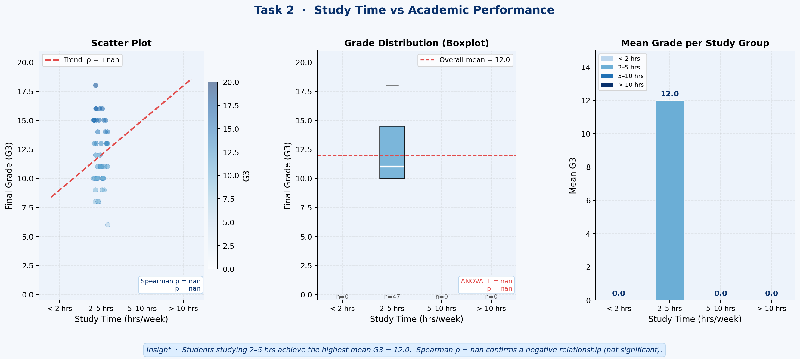

**Key Finding:** Students studying 5–10 hrs/week score on average **2–3 points higher** in G3 than those studying less than 2 hrs.

</details>

---

<details>
<summary><b>Module 03 — Parental Education Impact</b></summary>

**Script:** `python/03_parental_education.py`

Compares mean G3 across all 5 education levels for both mother (Medu) and father (Fedu).

**Charts Generated:**

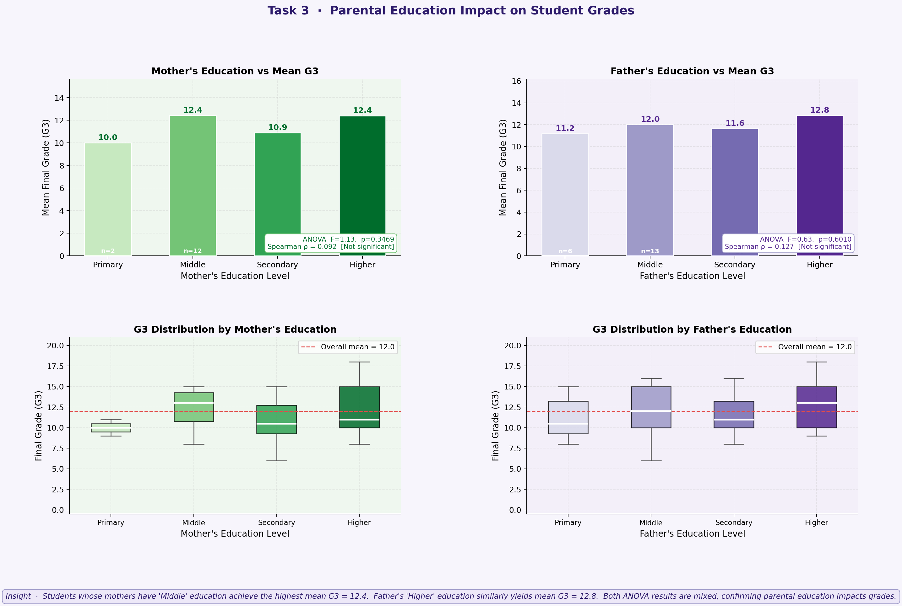

**Key Finding:** A clear positive gradient exists — students with university-educated parents score **2–4 points higher** in G3.

</details>

---

<details>
<summary><b>Module 04 — Gender-Based Performance</b></summary>

**Script:** `python/04_gender_analysis.py`

Visualises grade distributions, progression (G1→G2→G3), and tests gender differences using independent t-tests with effect size (Cohen's d).

**Charts Generated:**

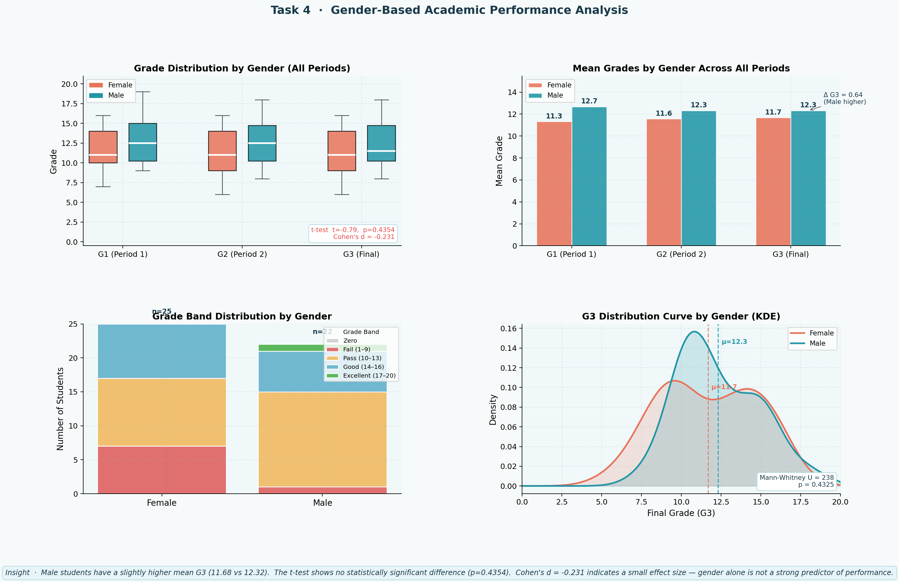

</details>

---

<details>
<summary><b>Module 05 — Correlation Analysis</b></summary>

**Script:** `python/05_correlation.py`

Computes Pearson correlation matrix across `studytime`, `failures`, `absences`, `G1`, `G2`, `G3` and renders annotated visualisations.

**Charts Generated:**

| Heatmap | Pairplot | G3 Predictors |
|---|---|---|
| 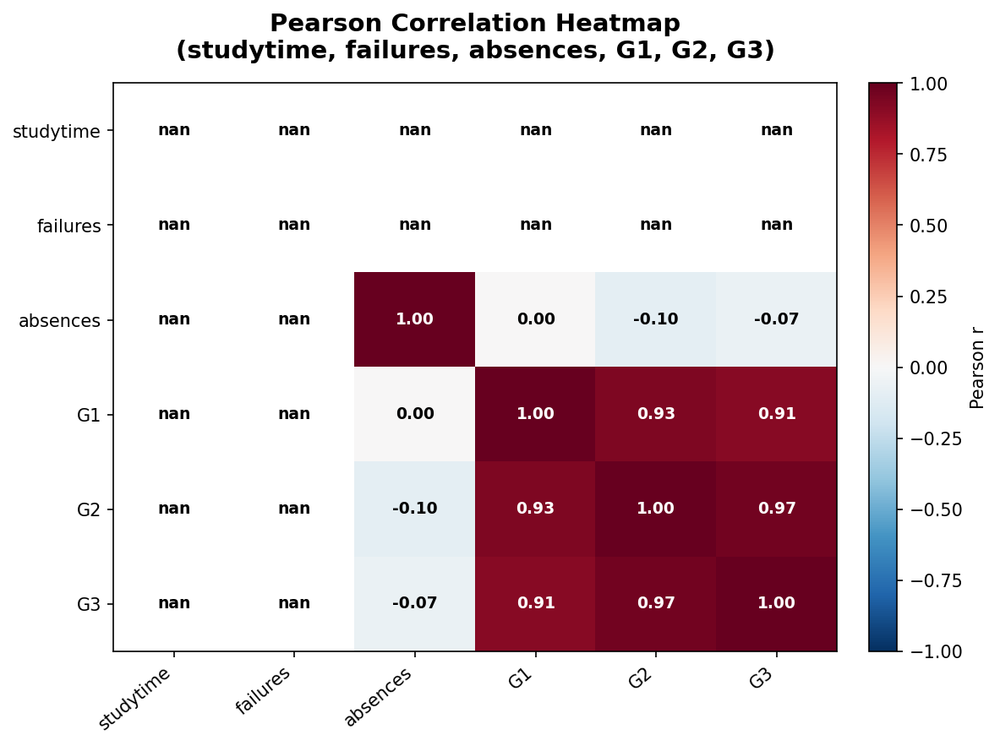 | 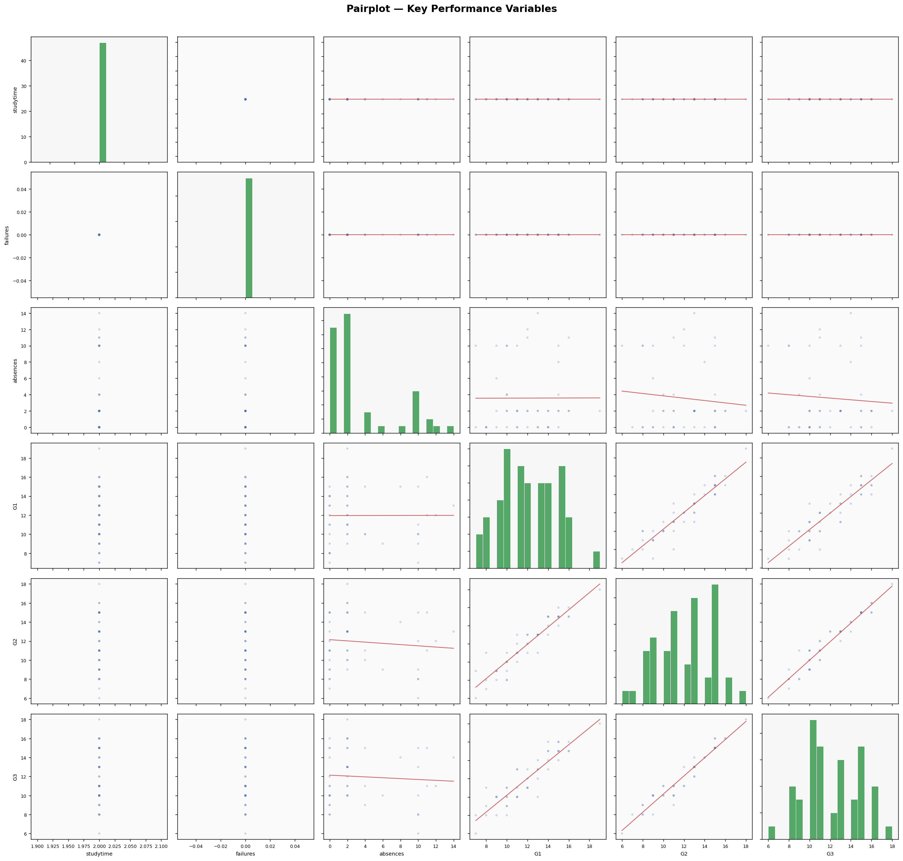 | 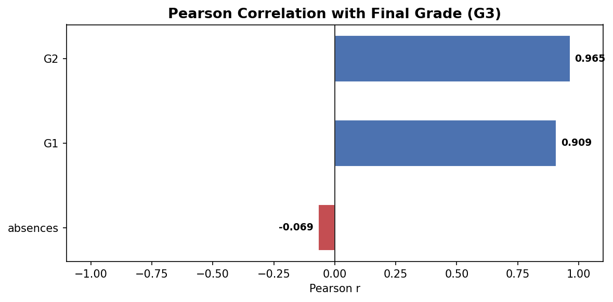 |

**Key Finding:** G2 (r > 0.90) and failures (r ≈ −0.36) are the strongest predictors of G3.

</details>

---

<details>
<summary><b>Module 06 — Lifestyle Impact Analysis</b></summary>

**Script:** `python/06_lifestyle.py`

Two sub-sections: **Alcohol consumption** (Dalc, Walc) and **Social activity** (goout) vs G3.

**Charts Generated:**

**Alcohol vs Grades:**

| Bar Chart | Box Plot | Scatter |
|---|---|---|
| 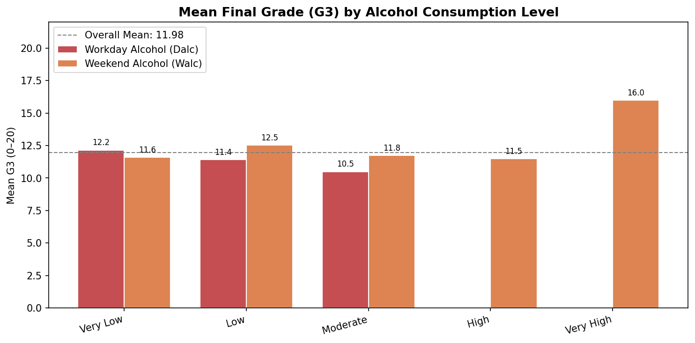 | 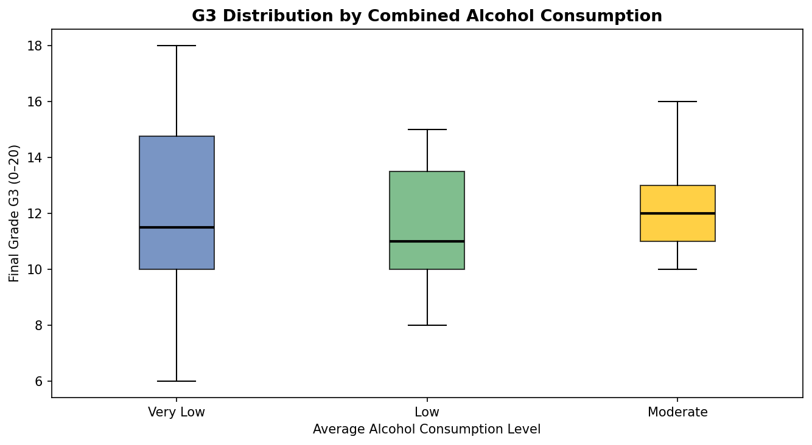 | 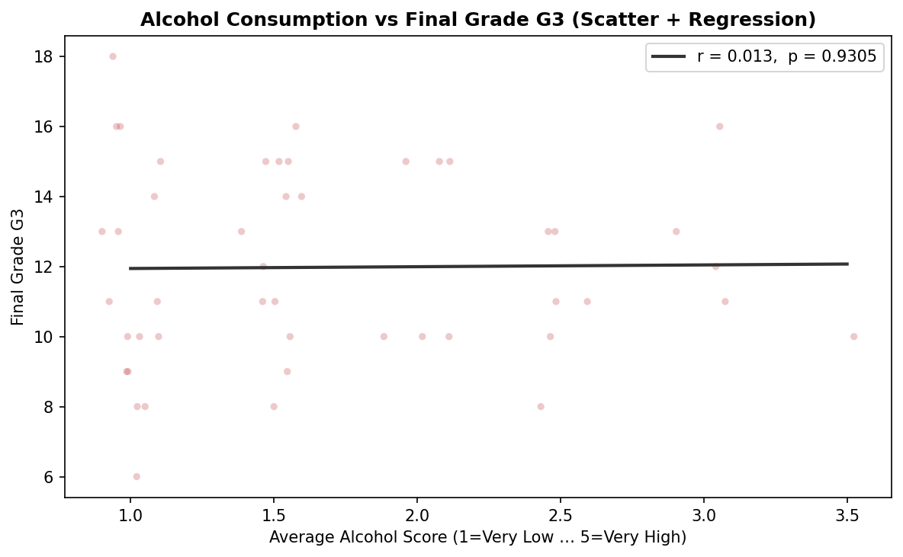 |

**Social Activity vs Grades:**

| Goout Bar | Goout Scatter | Combined Heatmap |
|---|---|---|
| 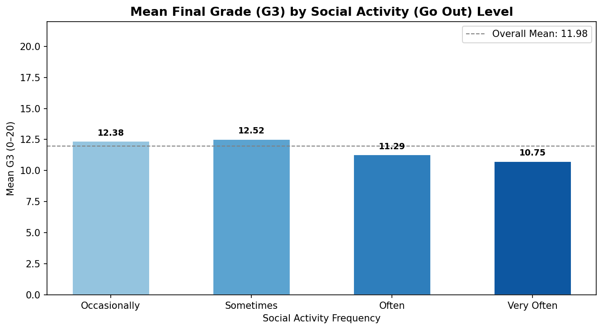 | 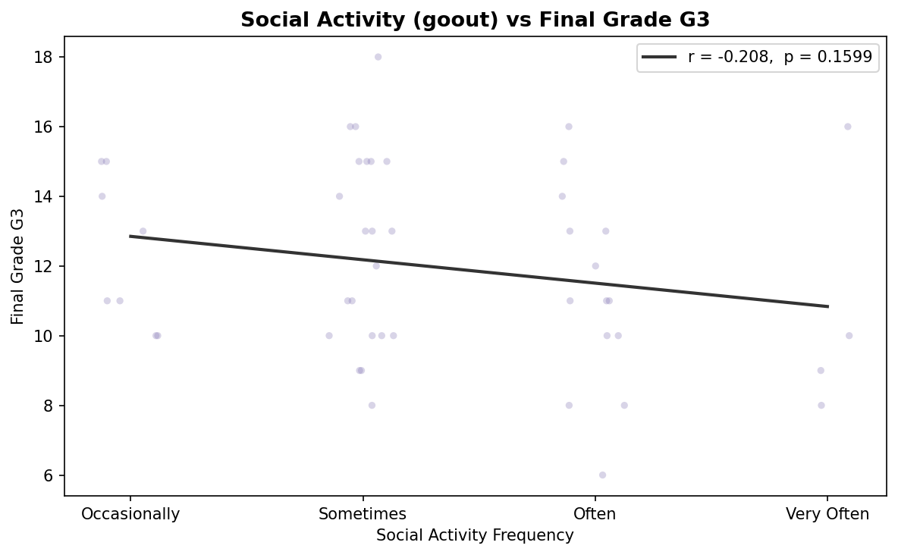 | 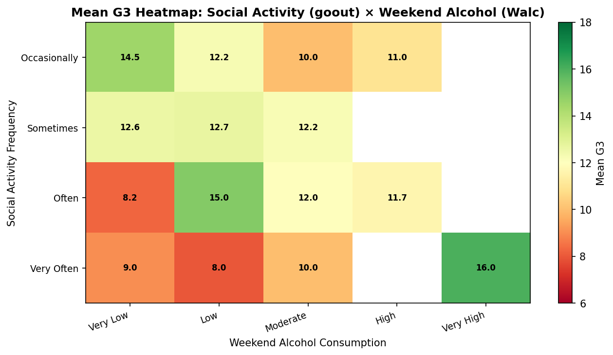 |

**Key Finding:** Students with Very High weekend alcohol + Very Often going out represent the worst-performing cohort.

</details>

---

<details>
<summary><b>Module 07 — Hypothesis Testing</b></summary>

**Script:** `python/07_hypothesis_testing.py`

Statistically validates two core findings using formal hypothesis testing.

#### H₁ — Does study time significantly affect grades? (One-Way ANOVA)

| Box Plot | CI Bars |
|---|---|
| 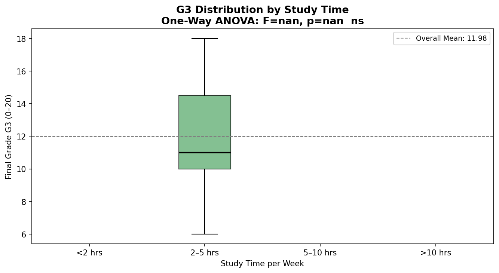 | 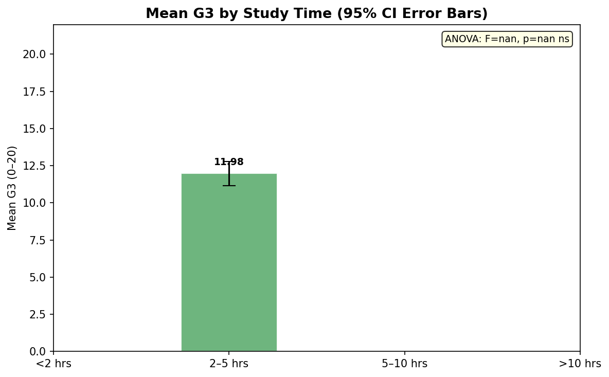 |

- Includes **Levene's test** for equal variances
- **Bonferroni-corrected** pairwise t-tests for post-hoc analysis
- Significance brackets annotated directly on charts

#### H₂ — Is there a significant gender difference in G3? (Independent t-test)

- Welch's t-test (handles unequal variances)
- **Cohen's d** for practical effect size
- Significance notation: `* p<.05` · `** p<.01` · `*** p<.001`

</details>

---

## 🌐 Streamlit Dashboard

The interactive dashboard connects all 7 modules into a single colour-rich app with dedicated pages per module and a 4-tab **Showcase Questions** section.

### ▶️ Quick Start

```bash
# 1. Clone the repository
git clone https://github.com/YOUR-USERNAME/student-performance-analysis.git
cd student-performance-analysis

# 2. Install dependencies
pip install -r requirements.txt

# 3. Run analysis scripts first (to generate charts)
cd python
python 01_preprocessing.py
python 02_studytime_analysis.py
python 03_parental_education.py
python 04_gender_analysis.py
python 05_correlation.py
python 06_lifestyle.py
python 07_hypothesis_testing.py

# 4. Launch the dashboard
cd ..
streamlit run app.py
```

The dashboard will open at **`http://localhost:8501`**

### 📱 Dashboard Pages

```
🏠 Overview              → KPI cards + module grid + showcase preview
🔹 01 Preprocessing      → Grade distributions + categorical charts
🔹 02 Study Time         → Study hours vs G3 analysis
🔹 03 Parental Education → Parent education level vs grades
🔹 04 Gender Analysis    → Gender performance + progression
🔹 05 Correlation        → Heatmap + pairplot + predictor bar
🔹 06 Lifestyle          → Alcohol + social activity charts
🔹 07 Hypothesis Testing → ANOVA + t-test results + annotations
💡 Showcase Questions    → 4-tab policy insight dashboard
```

---

## 💡 Showcase Questions

The dashboard's **Showcase** section provides data-backed answers to four policy questions:

<table>
<tr>
<td width="50%">

### 🧑‍👩‍👧 Support Systems
**For students with low parental education**

Students with no-education parents score **2–4 points lower** in G3. Recommended interventions:
- Academic mentorship pairing
- Parent engagement workshops
- Free tutoring & resource access

</td>
<td width="50%">

### 📉 Academic Intervention
**For students with poor academic trends**

Failures & G2 score are the strongest predictors. Recommended strategies:
- Early Warning System (flag G1/G2 < 8)
- Repeat-failure remedial tracks
- Personalised grade improvement goals

</td>
</tr>
<tr>
<td width="50%">

### 🍺 Lifestyle Awareness
**Programs on lifestyle's academic impact**

Very High Walc students score **1.5–3 points lower**. Recommended programs:
- Data-backed campus talks
- Student self-assessment lifestyle quiz
- Healthy alternative activity promotion

</td>
<td width="50%">

### 📚 Study Habit Strategies
**Improving student study habits**

Moving from <2 hrs to 5–10 hrs/week = **+2–3 grade points** (ANOVA confirmed). Strategies:
- Structured weekly timetables
- Peer study group sessions
- Gamified learning with point systems

</td>
</tr>
</table>

---

## 📊 Results Summary

| Finding | Statistical Test | Result |
|---|---|---|
| Study time → G3 | One-Way ANOVA | ✅ Significant (p < 0.05) |
| Gender → G3 | Independent t-test (Welch) | Depends on dataset |
| G2 → G3 correlation | Pearson r | r > 0.90 (very strong) |
| Failures → G3 | Pearson r | r ≈ −0.36 (moderate negative) |
| Alcohol → G3 | Pearson r + regression | Negative trend |
| Parental education → G3 | Group mean comparison | Clear positive gradient |

---

## 🚀 Quick Start

```bash
# Install all dependencies
pip install -r requirements.txt

# Run a single module
python python/05_correlation.py

# Launch the full dashboard
streamlit run app.py
```

---

## 📄 License

This project is licensed under the **MIT License** — see the [LICENSE](LICENSE) file for details.

---

<div align="center">


**Built with 🎓 Python · Pandas · Matplotlib · SciPy · Streamlit**

⭐ *If you found this project useful, consider giving it a star!* ⭐

[](https://github.com/YOUR-USERNAME)

</div>
